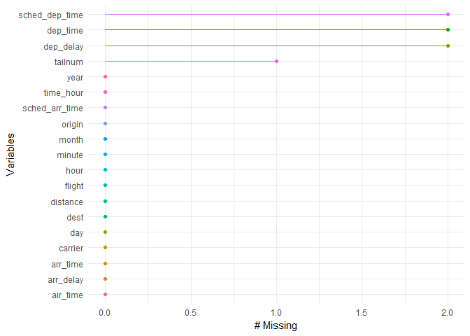

Data input and output
================
Matteo Sostero

Packages for this session
-------------------------

| package       | purpose                          | installation             |
|---------------|----------------------------------|--------------------------|
| *tidyverse*   | everything                       | CRAN                     |
| *nycflight13* | example datasets                 | CRAN                     |
| *lubridate*   | working with dates               | bundled with *tidyverse* |
| *glue*        | pasting and interpreting strings | bundled with *tidyverse* |
| *readxl*      | read Excel files                 | bundled with *tidyverse* |
| *naniar*      | handling of NA (missing values)  | CRAN                     |

If not yet installed, download packages with `install.packages("name")`. If asked, **do not compile from source**.

Load the packages for the session: *tidyverse* loads the core packages of the *tidyverse* and shows their version. Also load *readxl* to read Excel files and *haven* for importing and exporting Stata, SAS and SPSS data.

``` r
library(tidyverse)
```

    ## -- Attaching packages -------------------------------------------------------------------------------------------------------- tidyverse 1.2.1 --

    ## v ggplot2 2.2.1     v purrr   0.2.4
    ## v tibble  1.4.2     v dplyr   0.7.4
    ## v tidyr   0.8.0     v stringr 1.3.1
    ## v readr   1.1.1     v forcats 0.3.0

    ## -- Conflicts ----------------------------------------------------------------------------------------------------------- tidyverse_conflicts() --
    ## x dplyr::filter() masks stats::filter()
    ## x dplyr::lag()    masks stats::lag()

``` r
library(naniar)
library(readxl) # tidyverse, not loaded by default
library(haven) # tidyverse, not loaded by default
library(glue) # tidyverse, not loaded by default
```

    ## 
    ## Attaching package: 'glue'

    ## The following object is masked from 'package:dplyr':
    ## 
    ##     collapse

Data input and output
---------------------

Import a table with `read_csv` (NB, different than `read.csv`!). `read_csv` parses variables by guessing the column types based on heuristics:

``` r
flights_import <- read_csv("./data/flights.csv")
```

    ## Parsed with column specification:
    ## cols(
    ##   year = col_integer(),
    ##   month = col_integer(),
    ##   day = col_integer(),
    ##   dep_time = col_integer(),
    ##   sched_dep_time = col_integer(),
    ##   dep_delay = col_integer(),
    ##   arr_time = col_integer(),
    ##   sched_arr_time = col_integer(),
    ##   arr_delay = col_integer(),
    ##   carrier = col_character(),
    ##   flight = col_integer(),
    ##   tailnum = col_character(),
    ##   origin = col_character(),
    ##   dest = col_character(),
    ##   air_time = col_integer(),
    ##   distance = col_integer(),
    ##   hour = col_integer(),
    ##   minute = col_integer(),
    ##   time_hour = col_datetime(format = "")
    ## )

``` r
glimpse(flights_import)
```

    ## Observations: 100
    ## Variables: 19
    ## $ year           <int> 2013, 2013, 2013, 2013, 2013, 2013, 2013, 2013,...
    ## $ month          <int> 1, 1, 1, 1, 1, 1, 1, 1, 1, 1, 1, 1, 1, 1, 1, 1,...
    ## $ day            <int> 1, 1, 1, 1, 1, 1, 1, 1, 1, 1, 1, 1, 1, 1, 1, 1,...
    ## $ dep_time       <int> 517, 533, 542, 544, 554, 554, 555, 557, 557, NA...
    ## $ sched_dep_time <int> 515, 529, 540, 545, 600, 558, 600, 600, 600, NA...
    ## $ dep_delay      <int> 2, 4, 2, -1, -6, -4, -5, -3, -3, NA, -2, -2, -2...
    ## $ arr_time       <int> 830, 850, 923, 1004, 812, 740, 913, 709, 838, 7...
    ## $ sched_arr_time <int> 819, 830, 850, 1022, 837, 728, 854, 723, 846, 7...
    ## $ arr_delay      <int> 11, 20, 33, -18, -25, 12, 19, -14, -8, 8, -2, -...
    ## $ carrier        <chr> "UA", "UA", "AA", "B6", "DL", "UA", "B6", "EV",...
    ## $ flight         <int> 1545, 1714, 1141, 725, 461, 1696, 507, 5708, 79...
    ## $ tailnum        <chr> "N14228", "N24211", "N619AA", "N804JB", "N668DN...
    ## $ origin         <chr> "EWR", "LGA", "JFK", "JFK", "LGA", "EWR", "EWR"...
    ## $ dest           <chr> "IAH", "IAH", "MIA", "BQN", "ATL", "ORD", "FLL"...
    ## $ air_time       <int> 227, 227, 160, 183, 116, 150, 158, 53, 140, 138...
    ## $ distance       <int> 1400, 1416, 1089, 1576, 762, 719, 1065, 229, 94...
    ## $ hour           <int> 5, 5, 5, 5, 6, 5, 6, 6, 6, 6, 6, 6, 6, 6, 6, 5,...
    ## $ minute         <int> 15, 29, 40, 45, 0, 58, 0, 0, 0, 0, 0, 0, 0, 0, ...
    ## $ time_hour      <dttm> 2013-01-01 05:00:00, 2013-01-01 05:00:00, 2013...

inspect the data using `miss_var_summary` from *naniar* to see how many are missing:

``` r
flights_import %>% miss_var_summary()
```

    ## # A tibble: 19 x 4
    ##    variable       n_miss pct_miss n_miss_cumsum
    ##    <chr>           <int>    <dbl>         <int>
    ##  1 year                0        0             0
    ##  2 month               0        0             0
    ##  3 day                 0        0             0
    ##  4 dep_time            2        2             2
    ##  5 sched_dep_time      2        2             4
    ##  6 dep_delay           2        2             6
    ##  7 arr_time            0        0             6
    ##  8 sched_arr_time      0        0             6
    ##  9 arr_delay           0        0             6
    ## 10 carrier             0        0             6
    ## 11 flight              0        0             6
    ## 12 tailnum             1        1             7
    ## 13 origin              0        0             7
    ## 14 dest                0        0             7
    ## 15 air_time            0        0             7
    ## 16 distance            0        0             7
    ## 17 hour                0        0             7
    ## 18 minute              0        0             7
    ## 19 time_hour           0        0             7

``` r
# which variables have missing values?
flights_import %>% miss_var_summary() %>% filter(n_miss > 0)
```

    ## # A tibble: 4 x 4
    ##   variable       n_miss pct_miss n_miss_cumsum
    ##   <chr>           <int>    <dbl>         <int>
    ## 1 dep_time            2        2             2
    ## 2 sched_dep_time      2        2             4
    ## 3 dep_delay           2        2             6
    ## 4 tailnum             1        1             7

``` r
# plot of missing values by variables
flights_import %>% gg_miss_var()
```



Solving parsing failures
------------------------

Let's try with a (pathologically) tricky file

``` r
challenge <- read_csv("./data/challenge.csv")
```

    ## Parsed with column specification:
    ## cols(
    ##   x = col_integer(),
    ##   y = col_character()
    ## )

    ## Warning in rbind(names(probs), probs_f): number of columns of result is not
    ## a multiple of vector length (arg 1)

    ## Warning: 1000 parsing failures.
    ## row # A tibble: 5 x 5 col     row col   expected               actual             file               expected   <int> <chr> <chr>                  <chr>              <chr>              actual 1  1001 x     no trailing characters .23837975086644292 './data/challenge~ file 2  1002 x     no trailing characters .41167997173033655 './data/challenge~ row 3  1003 x     no trailing characters .7460716762579978  './data/challenge~ col 4  1004 x     no trailing characters .723450553836301   './data/challenge~ expected 5  1005 x     no trailing characters .614524137461558   './data/challenge~
    ## ... ................. ... .......................................................................... ........ .......................................................................... ...... .......................................................................... .... .......................................................................... ... .......................................................................... ... .......................................................................... ........ ..........................................................................
    ## See problems(...) for more details.

what's wrong? let's inspect:

``` r
problems(challenge)
```

    ## # A tibble: 1,000 x 5
    ##      row col   expected               actual             file             
    ##    <int> <chr> <chr>                  <chr>              <chr>            
    ##  1  1001 x     no trailing characters .23837975086644292 './data/challeng~
    ##  2  1002 x     no trailing characters .41167997173033655 './data/challeng~
    ##  3  1003 x     no trailing characters .7460716762579978  './data/challeng~
    ##  4  1004 x     no trailing characters .723450553836301   './data/challeng~
    ##  5  1005 x     no trailing characters .614524137461558   './data/challeng~
    ##  6  1006 x     no trailing characters .473980569280684   './data/challeng~
    ##  7  1007 x     no trailing characters .5784610391128808  './data/challeng~
    ##  8  1008 x     no trailing characters .2415937229525298  './data/challeng~
    ##  9  1009 x     no trailing characters .11437866208143532 './data/challeng~
    ## 10  1010 x     no trailing characters .2983446326106787  './data/challeng~
    ## # ... with 990 more rows

open the raw `csv` file to see what's happening (hint: line 1001):

we help `read_csv` parser by scanning more rows before guessing type:

``` r
challenge <- read_csv("./data/challenge.csv", guess_max = 1500)
```

    ## Parsed with column specification:
    ## cols(
    ##   x = col_double(),
    ##   y = col_date(format = "")
    ## )

we can also specify column types manually:

``` r
challenge <- read_csv("./data/challenge.csv", col_types = list(x = col_double(), y = col_date()))
```

\_pro-tip\_\_: import problematic columns as character and inspect them:

``` r
challenge <- read_csv("./data/challenge.csv", col_types = list(x = col_character(), y = col_character()))

challenge %>% pull(y) %>% sort() %>% unique()
```

    ##  [1] "2010-01-03" "2010-01-04" "2010-01-05" "2010-01-09" "2010-01-16"
    ##  [6] "2010-01-27" "2010-02-14" "2010-02-20" "2010-02-28" "2010-03-17"
    ## [11] "2010-03-19" "2010-03-23" "2010-03-24" "2010-03-26" "2010-03-27"
    ## [16] "2010-03-28" "2010-04-17" "2010-04-25" "2010-05-09" "2010-05-10"
    ##  [ reached getOption("max.print") -- omitted 890 entries ]

``` r
challenge %>% pull(x) %>% sort() %>% unique()
```

    ##  [1] "0.0024007875472307205" "0.0024924282915890217"
    ##  [3] "0.004081981023773551"  "0.006291386438533664" 
    ##  [5] "0.007070775609463453"  "0.008419594960287213" 
    ##  [7] "0.008509289706125855"  "0.00876278686337173"  
    ##  [9] "0.009083196753636003"  "0.01098793395794928"  
    ## [11] "0.014630335848778486"  "0.016221591737121344" 
    ## [13] "0.01808677427470684"   "0.018906170036643744" 
    ## [15] "0.019359473139047623"  "0.020153695717453957" 
    ## [17] "0.021540780318900943"  "0.02179576293565333"  
    ## [19] "0.02280205488204956"   "0.023566172923892736" 
    ##  [ reached getOption("max.print") -- omitted 1901 entries ]

`readr` tries to guess the type of object based on heuristics:

``` r
guess_parser("123")
```

    ## [1] "integer"

``` r
guess_parser("1,234")
```

    ## [1] "number"

``` r
guess_parser(c(".", "-"))
```

    ## [1] "character"

``` r
guess_parser(c("10W", "20N"))
```

    ## [1] "character"

``` r
guess_parser("10:30")
```

    ## [1] "time"

``` r
guess_parser("15/06/2018")
```

    ## [1] "character"

Import from internet
--------------------

Read a file from a URL:

``` r
flights_import <- read_csv("https://raw.githubusercontent.com/CoMoS-SA/workshop-R-tidyverse/master/data/flights.csv")
```

    ## Parsed with column specification:
    ## cols(
    ##   year = col_integer(),
    ##   month = col_integer(),
    ##   day = col_integer(),
    ##   dep_time = col_integer(),
    ##   sched_dep_time = col_integer(),
    ##   dep_delay = col_integer(),
    ##   arr_time = col_integer(),
    ##   sched_arr_time = col_integer(),
    ##   arr_delay = col_integer(),
    ##   carrier = col_character(),
    ##   flight = col_integer(),
    ##   tailnum = col_character(),
    ##   origin = col_character(),
    ##   dest = col_character(),
    ##   air_time = col_integer(),
    ##   distance = col_integer(),
    ##   hour = col_integer(),
    ##   minute = col_integer(),
    ##   time_hour = col_datetime(format = "")
    ## )

Importing Excel files with *readxl*
-----------------------------------

We can import Excel workbooks with `read_excel`: it works with `.xlsx` and `.xls` files.

``` r
# Enumerate sheets in the workbook
excel_sheets("./data/nycflights.xlsx")
```

    ## [1] "Flights"  "Airlines"

``` r
# Access a given sheet
flights_xl <- read_excel("./data/nycflights.xlsx", sheet = "Flights")
airlines_xl <- read_excel("./data/nycflights.xlsx", sheet = "Airlines")
```

NB: the package *readxl* does not provide functions to *export* Excel workbooks, but the package `openxls` does.

Importing and exporting Stata `.dta` files using *haven*
--------------------------------------------------------

``` r
# read .dta file.
# Default text encoding in Stata >= 14 is utf-8, but before also be "windows-1252"

mtcars_stata <- read_dta("./data/mtcars.dta")
mtcars_stata <- read_dta("./data/mtcars.dta", encoding = "UTF-8")

write_dta(mtcars_stata, "./data/mtcars.dta", version = 13)
```

Saving data in R
----------------

The best format for saving R objects for later use is `.rds`

``` r
write_rds(mtcars_stata, "./data/mtcars.rds")
mtcars_stata <- read_rds("./data/mtcars.rds")
```

Reading and merging all files in a directory
--------------------------------------------

Sometimes data is fractioned in disparate files, differing only by the value of a variable. In the `./data/scattered/` directory, I fractioned the `flights` data by month.

Enumerate files in that directory:

``` r
list.files("./data/scattered/") # bare file names
```

    ##  [1] "flights_April.csv"     "flights_August.csv"   
    ##  [3] "flights_December.csv"  "flights_February.csv" 
    ##  [5] "flights_January.csv"   "flights_July.csv"     
    ##  [7] "flights_June.csv"      "flights_March.csv"    
    ##  [9] "flights_May.csv"       "flights_November.csv" 
    ## [11] "flights_October.csv"   "flights_September.csv"

``` r
list.files("./data/scattered/", full.names = TRUE) # relative path and file names
```

    ##  [1] "./data/scattered/flights_April.csv"    
    ##  [2] "./data/scattered/flights_August.csv"   
    ##  [3] "./data/scattered/flights_December.csv" 
    ##  [4] "./data/scattered/flights_February.csv" 
    ##  [5] "./data/scattered/flights_January.csv"  
    ##  [6] "./data/scattered/flights_July.csv"     
    ##  [7] "./data/scattered/flights_June.csv"     
    ##  [8] "./data/scattered/flights_March.csv"    
    ##  [9] "./data/scattered/flights_May.csv"      
    ## [10] "./data/scattered/flights_November.csv" 
    ## [11] "./data/scattered/flights_October.csv"  
    ## [12] "./data/scattered/flights_September.csv"

Read files and assign them as elements of a list:

``` r
flights_frac <- list.files("./data/scattered/", full.names = TRUE) %>%
  map(~ read_csv(.))
```

    ## Parsed with column specification:
    ## cols(
    ##   year = col_integer(),
    ##   month = col_integer(),
    ##   day = col_integer(),
    ##   origin = col_character(),
    ##   dest = col_character(),
    ##   carrier = col_character()
    ## )
    ## Parsed with column specification:
    ## cols(
    ##   year = col_integer(),
    ##   month = col_integer(),
    ##   day = col_integer(),
    ##   origin = col_character(),
    ##   dest = col_character(),
    ##   carrier = col_character()
    ## )
    ## Parsed with column specification:
    ## cols(
    ##   year = col_integer(),
    ##   month = col_integer(),
    ##   day = col_integer(),
    ##   origin = col_character(),
    ##   dest = col_character(),
    ##   carrier = col_character()
    ## )
    ## Parsed with column specification:
    ## cols(
    ##   year = col_integer(),
    ##   month = col_integer(),
    ##   day = col_integer(),
    ##   origin = col_character(),
    ##   dest = col_character(),
    ##   carrier = col_character()
    ## )
    ## Parsed with column specification:
    ## cols(
    ##   year = col_integer(),
    ##   month = col_integer(),
    ##   day = col_integer(),
    ##   origin = col_character(),
    ##   dest = col_character(),
    ##   carrier = col_character()
    ## )
    ## Parsed with column specification:
    ## cols(
    ##   year = col_integer(),
    ##   month = col_integer(),
    ##   day = col_integer(),
    ##   origin = col_character(),
    ##   dest = col_character(),
    ##   carrier = col_character()
    ## )
    ## Parsed with column specification:
    ## cols(
    ##   year = col_integer(),
    ##   month = col_integer(),
    ##   day = col_integer(),
    ##   origin = col_character(),
    ##   dest = col_character(),
    ##   carrier = col_character()
    ## )
    ## Parsed with column specification:
    ## cols(
    ##   year = col_integer(),
    ##   month = col_integer(),
    ##   day = col_integer(),
    ##   origin = col_character(),
    ##   dest = col_character(),
    ##   carrier = col_character()
    ## )
    ## Parsed with column specification:
    ## cols(
    ##   year = col_integer(),
    ##   month = col_integer(),
    ##   day = col_integer(),
    ##   origin = col_character(),
    ##   dest = col_character(),
    ##   carrier = col_character()
    ## )
    ## Parsed with column specification:
    ## cols(
    ##   year = col_integer(),
    ##   month = col_integer(),
    ##   day = col_integer(),
    ##   origin = col_character(),
    ##   dest = col_character(),
    ##   carrier = col_character()
    ## )
    ## Parsed with column specification:
    ## cols(
    ##   year = col_integer(),
    ##   month = col_integer(),
    ##   day = col_integer(),
    ##   origin = col_character(),
    ##   dest = col_character(),
    ##   carrier = col_character()
    ## )
    ## Parsed with column specification:
    ## cols(
    ##   year = col_integer(),
    ##   month = col_integer(),
    ##   day = col_integer(),
    ##   origin = col_character(),
    ##   dest = col_character(),
    ##   carrier = col_character()
    ## )

Append all the list elements (tibbles) in a single tibble

``` r
flights_frac <- list.files("./data/scattered/", full.names = TRUE) %>%
  map(~ read_csv(.)) %>%
  bind_rows()
```

    ## Parsed with column specification:
    ## cols(
    ##   year = col_integer(),
    ##   month = col_integer(),
    ##   day = col_integer(),
    ##   origin = col_character(),
    ##   dest = col_character(),
    ##   carrier = col_character()
    ## )
    ## Parsed with column specification:
    ## cols(
    ##   year = col_integer(),
    ##   month = col_integer(),
    ##   day = col_integer(),
    ##   origin = col_character(),
    ##   dest = col_character(),
    ##   carrier = col_character()
    ## )
    ## Parsed with column specification:
    ## cols(
    ##   year = col_integer(),
    ##   month = col_integer(),
    ##   day = col_integer(),
    ##   origin = col_character(),
    ##   dest = col_character(),
    ##   carrier = col_character()
    ## )
    ## Parsed with column specification:
    ## cols(
    ##   year = col_integer(),
    ##   month = col_integer(),
    ##   day = col_integer(),
    ##   origin = col_character(),
    ##   dest = col_character(),
    ##   carrier = col_character()
    ## )
    ## Parsed with column specification:
    ## cols(
    ##   year = col_integer(),
    ##   month = col_integer(),
    ##   day = col_integer(),
    ##   origin = col_character(),
    ##   dest = col_character(),
    ##   carrier = col_character()
    ## )
    ## Parsed with column specification:
    ## cols(
    ##   year = col_integer(),
    ##   month = col_integer(),
    ##   day = col_integer(),
    ##   origin = col_character(),
    ##   dest = col_character(),
    ##   carrier = col_character()
    ## )
    ## Parsed with column specification:
    ## cols(
    ##   year = col_integer(),
    ##   month = col_integer(),
    ##   day = col_integer(),
    ##   origin = col_character(),
    ##   dest = col_character(),
    ##   carrier = col_character()
    ## )
    ## Parsed with column specification:
    ## cols(
    ##   year = col_integer(),
    ##   month = col_integer(),
    ##   day = col_integer(),
    ##   origin = col_character(),
    ##   dest = col_character(),
    ##   carrier = col_character()
    ## )
    ## Parsed with column specification:
    ## cols(
    ##   year = col_integer(),
    ##   month = col_integer(),
    ##   day = col_integer(),
    ##   origin = col_character(),
    ##   dest = col_character(),
    ##   carrier = col_character()
    ## )
    ## Parsed with column specification:
    ## cols(
    ##   year = col_integer(),
    ##   month = col_integer(),
    ##   day = col_integer(),
    ##   origin = col_character(),
    ##   dest = col_character(),
    ##   carrier = col_character()
    ## )
    ## Parsed with column specification:
    ## cols(
    ##   year = col_integer(),
    ##   month = col_integer(),
    ##   day = col_integer(),
    ##   origin = col_character(),
    ##   dest = col_character(),
    ##   carrier = col_character()
    ## )
    ## Parsed with column specification:
    ## cols(
    ##   year = col_integer(),
    ##   month = col_integer(),
    ##   day = col_integer(),
    ##   origin = col_character(),
    ##   dest = col_character(),
    ##   carrier = col_character()
    ## )

`map_df` maps the function directly into a tibble

``` r
flights_frac <- list.files("./data/scattered/", full.names = TRUE) %>%
  map_df(~ read_csv(.))
```

    ## Parsed with column specification:
    ## cols(
    ##   year = col_integer(),
    ##   month = col_integer(),
    ##   day = col_integer(),
    ##   origin = col_character(),
    ##   dest = col_character(),
    ##   carrier = col_character()
    ## )
    ## Parsed with column specification:
    ## cols(
    ##   year = col_integer(),
    ##   month = col_integer(),
    ##   day = col_integer(),
    ##   origin = col_character(),
    ##   dest = col_character(),
    ##   carrier = col_character()
    ## )
    ## Parsed with column specification:
    ## cols(
    ##   year = col_integer(),
    ##   month = col_integer(),
    ##   day = col_integer(),
    ##   origin = col_character(),
    ##   dest = col_character(),
    ##   carrier = col_character()
    ## )
    ## Parsed with column specification:
    ## cols(
    ##   year = col_integer(),
    ##   month = col_integer(),
    ##   day = col_integer(),
    ##   origin = col_character(),
    ##   dest = col_character(),
    ##   carrier = col_character()
    ## )
    ## Parsed with column specification:
    ## cols(
    ##   year = col_integer(),
    ##   month = col_integer(),
    ##   day = col_integer(),
    ##   origin = col_character(),
    ##   dest = col_character(),
    ##   carrier = col_character()
    ## )
    ## Parsed with column specification:
    ## cols(
    ##   year = col_integer(),
    ##   month = col_integer(),
    ##   day = col_integer(),
    ##   origin = col_character(),
    ##   dest = col_character(),
    ##   carrier = col_character()
    ## )
    ## Parsed with column specification:
    ## cols(
    ##   year = col_integer(),
    ##   month = col_integer(),
    ##   day = col_integer(),
    ##   origin = col_character(),
    ##   dest = col_character(),
    ##   carrier = col_character()
    ## )
    ## Parsed with column specification:
    ## cols(
    ##   year = col_integer(),
    ##   month = col_integer(),
    ##   day = col_integer(),
    ##   origin = col_character(),
    ##   dest = col_character(),
    ##   carrier = col_character()
    ## )
    ## Parsed with column specification:
    ## cols(
    ##   year = col_integer(),
    ##   month = col_integer(),
    ##   day = col_integer(),
    ##   origin = col_character(),
    ##   dest = col_character(),
    ##   carrier = col_character()
    ## )
    ## Parsed with column specification:
    ## cols(
    ##   year = col_integer(),
    ##   month = col_integer(),
    ##   day = col_integer(),
    ##   origin = col_character(),
    ##   dest = col_character(),
    ##   carrier = col_character()
    ## )
    ## Parsed with column specification:
    ## cols(
    ##   year = col_integer(),
    ##   month = col_integer(),
    ##   day = col_integer(),
    ##   origin = col_character(),
    ##   dest = col_character(),
    ##   carrier = col_character()
    ## )
    ## Parsed with column specification:
    ## cols(
    ##   year = col_integer(),
    ##   month = col_integer(),
    ##   day = col_integer(),
    ##   origin = col_character(),
    ##   dest = col_character(),
    ##   carrier = col_character()
    ## )
